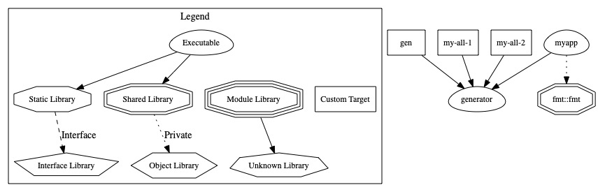
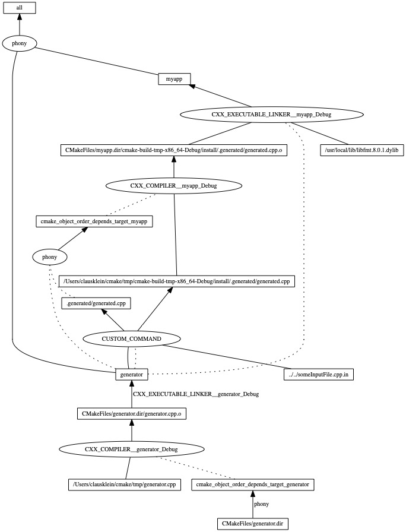

# Howto generating files at build Time with CMake

Thanks to [Craig Scott](https://crascit.com/author/crascit/) for his Blog!

## A modified example from https://crascit.com/2017/04/18/generated-sources-in-cmake-builds/

Instead of using [add_custom_target()](https://cmake.org/cmake/help/latest/command/add_custom_target.html)
to generate the sources manually, you should define custom `OUTPUTS <files>` with `DEPENDS <files>` using
[add_custom_command()](https://cmake.org/cmake/help/latest/command/add_custom_command.html).

CMake can then automatically work out dependencies when those outputs are used as inputs to another target.

[Sam Thursfield has more CMake tips](https://samthursfield.wordpress.com/2015/11/21/cmake-dependencies-between-targets-and-files-and-custom-commands/)
if you are intrested.

## CMake and Ninja can generate graphviz files showing the dependencies between the targets in a project

This dependency trees [https://en.wikipedia.org/wiki/Directed_acyclic_graph](DAG) are generated with this
[CMakeLists.txt](CMakeLists.txt) and **dot**, a tool from [https://graphviz.org/Gallery/directed/ninja.html](graphviz)

